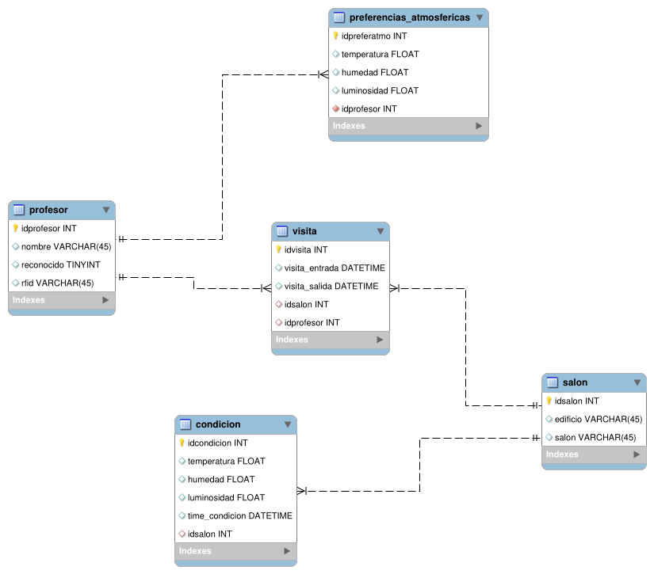
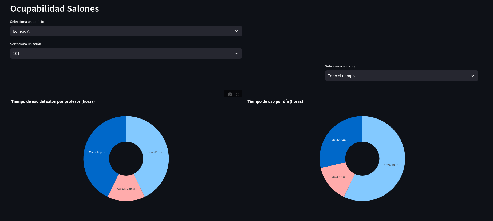

## Tabla de Contenidos

- [Introducción](#introducción)
- [Objetivos](#Objetivos)
- [Desarrollo](#Desarrollo)

# Introducción

Este documento pretende funcionar a manera de reporte, pero igualmente de manual para la utilización de la plataforma de monitoreo de sensores propuesta. 

El uso de IoT se ha vuelto una constante en nuestro día a día desde su aparición, prácticamente en la mayoría de nuestras actividades vemos involucrado al internet, desde cerraduras en el hogar hasta máquinas de riego. 

Todos los datos recolectados deben de ir a parar a algún lado y no solo eso, deben de existir mecanismos o herramientas que nos permitan visualizarlos. 

Bajo está premisa, el uso de una aplicación web que nos permita monitorear de manera constante los datos que te recopilan los dispositivos de IoT es fundamental, de esta forma podremos aprovechar de mayor forma la incorporación de estos dispositivos. Así mismo, es fundamental el poder interactuar con estos datos, con la finalidad de volverlos más atractivos y sencillos para quien los consume. 

Este proyecto busca como objetivo general el construir una plataforma que nos permita monitorear los datos recolectados por un conjunto de sensores, esta información esta relacionada con el reconocimiento de profesores que acceden a cada uno de los salones y de las condiciones atmosféricas que presenta cada uno de los mismos. Finalmente, el propósito es poder generar reportes en PDF que nos permitan generar la recolección de datos de manera general en un rango de tiempo. 

# Objetivos 
1. Apoyo en el diseño de la Base de Datos Relacional para almacenar la información de las entidades participantes en un entorno académico.
2. Apoyo en el diseño de una aplicación web basada en el patrón de diseño **Modelo-Vista-Controlador** para la visualización y procesamiento de datos obtenidos por la red.
3. Apoyo en el mantenimiento de la página web del área de investigación en sistemas de información Inteligentes.

# Desarrollo
## Modelo de Base de Datos Relacional
Basado en la información recibida, se propuso la siguiente base de datos relacional que nos permita guardar uno a uno los registros que se vayan extrayendo de los sensores.

- La tabla **condición** tomará todas y cada una de las mediciones de condición del salón independientemente de una visita, esto con la finalidad de que las condiciones se continúen tomando a lo largo del tiempo.
- La tabla **salón** es una restricción de valor donde solamente estarán los salones que pertenezcan al sistema. 
- La tabla **profesores** funciona bastante similar en ese aspecto, ya que determinara si uno de los profesores es reconocido o no. 
- La tabla **preferencias_atomosféricas** determinará que condiciones son las preferidas para un profesor, en realidad esto esta representado como una relación *1:1*, pero se realizó con una relación *1:M*. Esto no genera ningún conflicto ya que dentro del aplicativo de *python* se restringe la capacidad de ingresar más valores de condiciones atmosféricas para un profesor. 
- Por último, la tabla *visita* funciona en forma de una tabla que concentra los datos del profesor y del salón, en este sentido para cada profesor habrá una o más visitas a uno o más salones, así como un salón tendrá una o más visitas de uno o más profesores. 

# Aplicativo de Python
Se pensó en el uso de un dashboard que mostrará la información discriminando de acuerdo al salón y edificio elegido en un rango de tiempo preestablecido. 

Se generan dos gráficas de pastel para determina las horas que uso el profesor el salón y otra que determina las horas que se uso el salón por día, ambas en un rango de tiempo establecido. 

